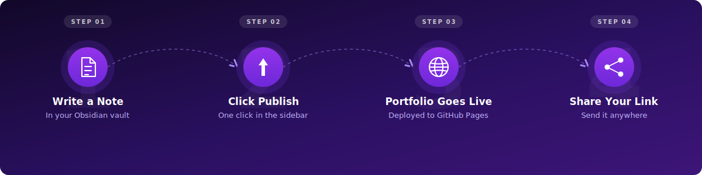
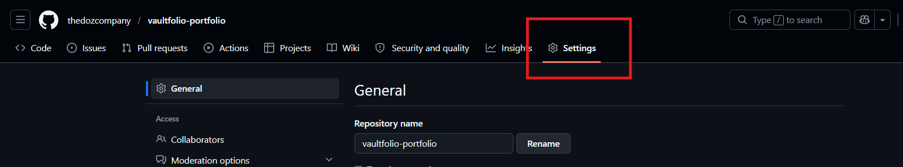
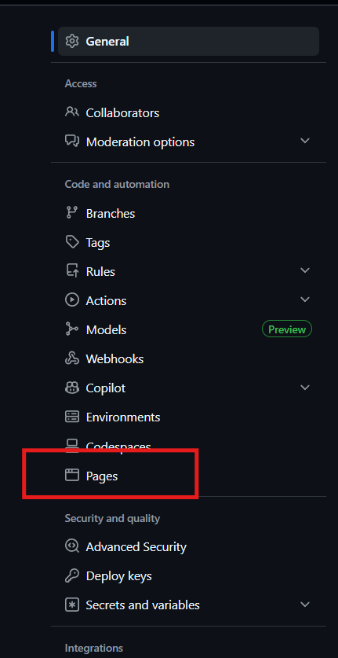
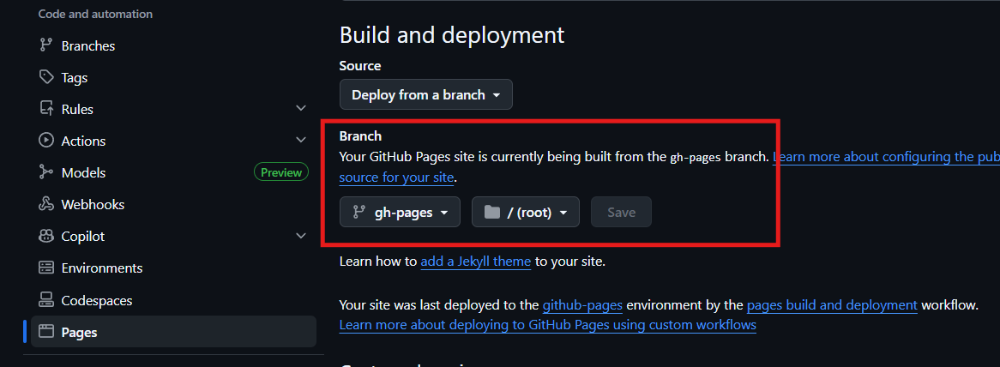
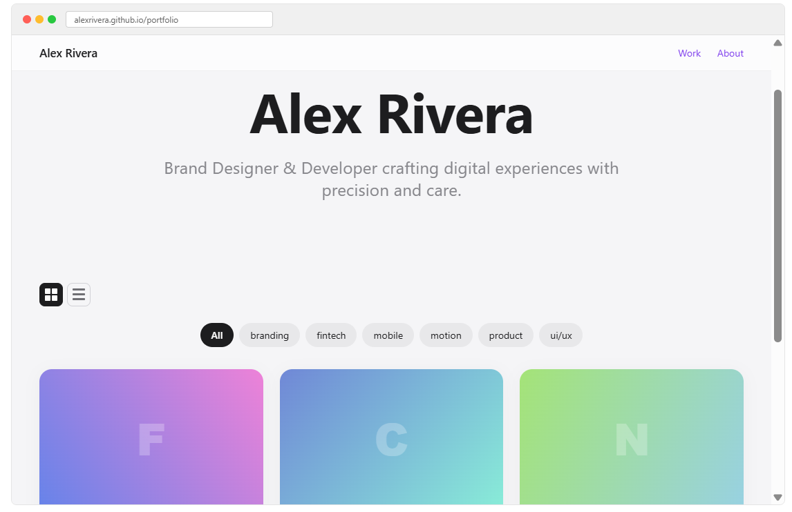
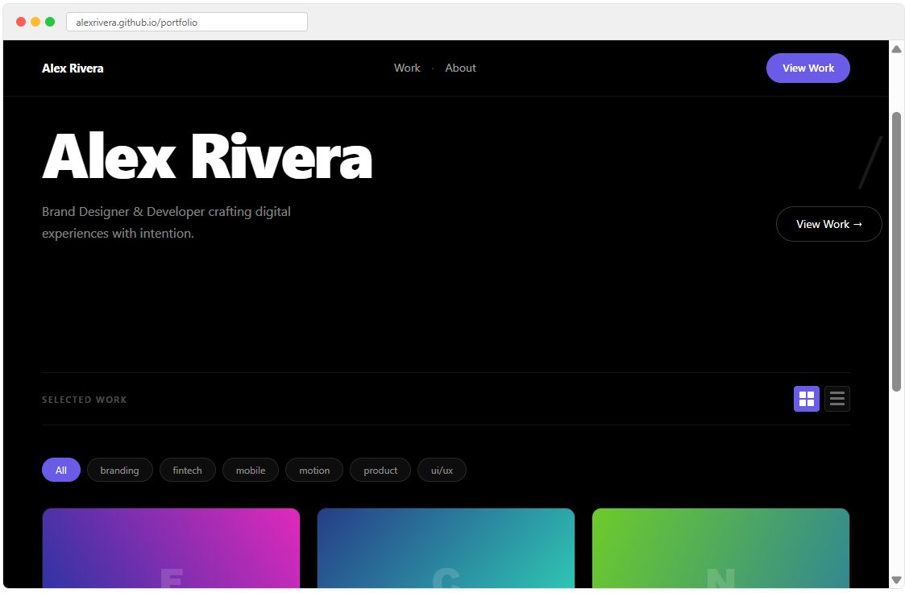
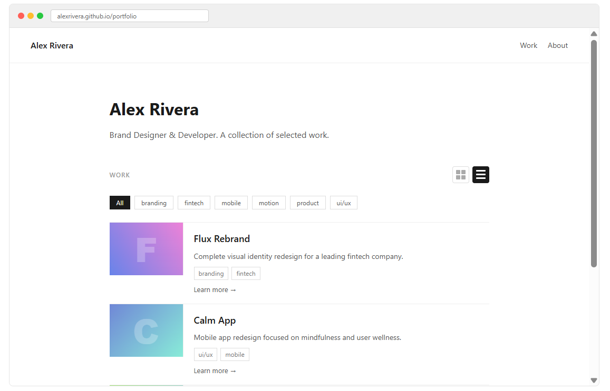
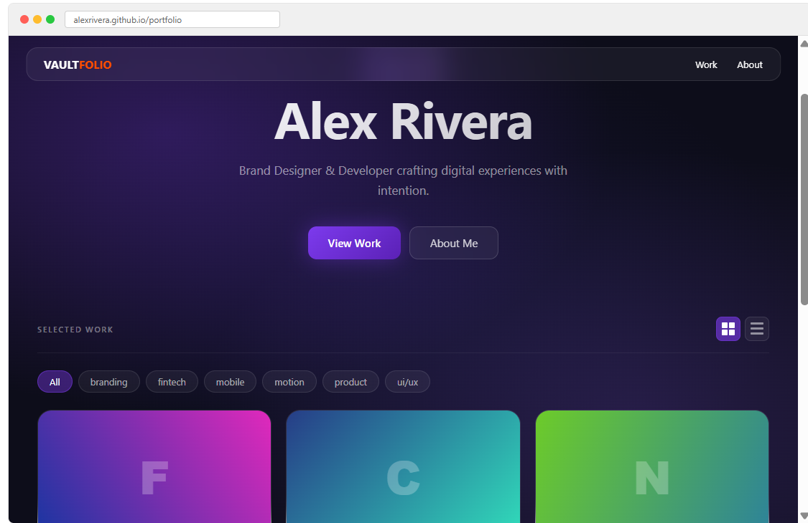

# VaultFolio

> Publish your Obsidian notes as a live portfolio. Two clicks.

  

**Publish your first portfolio in under 5 minutes.**

---


---

## Who Is This For?

**Best for:**
- Developers showcasing projects
- Designers sharing case studies
- Freelancers sending portfolio links to clients
- Students building portfolios for job applications
- Creators using Obsidian who want a public presence

**Not ideal for:**
- Users looking for drag-and-drop website builders
- Users without an Obsidian vault

---

## How It Works



---

## Do I Need GitHub?

Yes — but only for **free hosting**. No coding required. No terminal required.

GitHub gives you a free public URL for your portfolio (e.g. `yourname.github.io/portfolio`). VaultFolio handles all the technical work. You just connect your account.

---

## Why VaultFolio?

- **One-click publish** — write in Obsidian, deploy anywhere
- **No coding required** — zero terminal, zero git commands
- **GitHub OAuth** — connect securely, no tokens needed
- **4 beautiful themes** — switch with one click
- **Image support** — drag and drop images, they deploy automatically
- **Mobile responsive** — looks great on every device
- **Free forever** — core features always free, open source

---

## Quick Start

### Fast Path (under 5 minutes)

**1. Install** — Add via BRAT: `thedozcompany/VaultFolio`

**2. Connect GitHub** — Settings → VaultFolio → Connect GitHub → enter code at [github.com/login/device](https://github.com/login/device)

**3. Create a GitHub repo** — Go to [github.com/new](https://github.com/new) → name it (e.g. `my-portfolio`) → set to **Public** → check **Add a README file** → Create

**4. Add your repo** — Settings → VaultFolio → GitHub repository → `yourusername/my-portfolio`

**5. Create a note** — In your portfolio folder (Settings → VaultFolio → Portfolio folder), create a note with:
```yaml
---
title: My First Project
published: true
description: What this project does
---
```

**6. Publish** — Click **Build Site** → **Deploy to GitHub**

**7. Enable Pages** — On GitHub, go to your repository → Settings → Pages → select `gh-pages` → Save

**Done.** Wait 2-3 minutes, then visit `yourusername.github.io/my-portfolio`

---

### Detailed Setup

#### Install VaultFolio

**Option A: BRAT (Recommended)**

1. Install **BRAT** from Obsidian community plugins
2. BRAT settings → **Add Beta Plugin** → enter `thedozcompany/VaultFolio`
3. Enable VaultFolio in Community Plugins

**Option B: Manual**

1. Download `main.js`, `manifest.json`, `styles.css` from [latest release](https://github.com/thedozcompany/VaultFolio/releases)
2. Create folder: `<vault>/.obsidian/plugins/vaultfolio/`
3. Copy files into that folder → enable in Community Plugins

#### Connect GitHub

1. Open **Settings → VaultFolio**
2. Click **Connect GitHub**
3. A code like `XXXX-XXXX` will appear
4. Visit [github.com/login/device](https://github.com/login/device)
5. Enter the code → click **Authorize VaultFolio**

#### Create GitHub Repository

1. Go to [github.com/new](https://github.com/new)
2. Name it (e.g. `my-portfolio`) → set to **Public**
3. Check **Add a README file** → Create repository

#### Enable GitHub Pages

In your GitHub repository after deploying:

**Step 1** — Click the Settings tab



**Step 2** — Click Pages in the left sidebar



**Step 3** — Select `gh-pages` branch → click Save



Wait 2-3 minutes. Your portfolio will be live.

---

## Themes

| Apple Minimalist | Dark Cinematic |
|-----------------|----------------|
|  |  |

| Simple | Glassmorphism |
|--------|---------------|
|  |  |

Change theme in **Settings → VaultFolio → Theme**

Preview live: [theme-preview page](https://thedozcompany.github.io/VaultFolio/theme-preview.html)

---

## Frontmatter Reference

Copy-paste starter template:

```yaml
---
title: My Project
published: true
description: What this project does
cover: "![[image.png]]"
tags: [design, web]
date: 2026-04-25
---
```

| Field | Required | Description |
|-------|----------|-------------|
| `title` | Yes | Project title |
| `published` | Yes | Set to `true` to publish |
| `description` | No | Short description shown on cards |
| `cover` | No | Cover image for homepage card |
| `tags` | No | Filter tags on homepage |
| `date` | No | Project date `YYYY-MM-DD` |
| `show_properties` | No | Fields to display publicly on project page |

---

## Cover Image

```yaml
cover: "![[my-image.png]]"
```

If you use a different property name (e.g. `image`):
**Settings → VaultFolio → Cover image property** → type `image`

Cards without a cover automatically get a unique gradient.

---

## show_properties

Show selected frontmatter fields publicly. Hide private ones.

```yaml
---
title: My Project
published: true
links: https://artstation.com/project
time_taken: 3 weeks
software: Blender, Maya
client_name: John Doe
show_properties: [links, time_taken, software]
---
```

`client_name` is not listed in `show_properties` so it stays private.

---

## Callouts

```
> [!note] Title
> Content here.

> [!warning] Watch out
> Something important.
```

Supported: `note` `info` `tip` `warning` `danger` `question` `success` `failure` `bug` `example` `quote` `abstract`

---

## Troubleshooting

**GitHub not connecting**
→ Code expires in 15 minutes. Click Connect GitHub again and enter code quickly.

**Deploy failed — repo not found**
→ Check format: `username/repo-name` (no spaces, no URL)
→ Make sure repository is public

**Images not showing**
→ Use format: `cover: "![[image.png]]"`
→ Rebuild and redeploy after adding images

**GitHub Pages not loading**
→ Go to repo → Settings → Pages → select `gh-pages` → Save
→ Wait 2-3 minutes → hard refresh `Ctrl + Shift + R`

**Site looks outdated**
→ Click Build Site then Deploy to GitHub again

**BRAT shows no update available**
→ In BRAT click the reload icon next to VaultFolio

---

## Roadmap

- Custom domain support
- Analytics dashboard
- Template support
- Homepage default tag filter
- Custom theme folder
- Obsidian community plugin store listing

---

## Join the Beta

VaultFolio is in active beta. Founding user spots available.

**What you get:**
- “Lifetime access to Pro plan for founding users”
- Direct influence on roadmap
- Founding User badge

<!-- 
  PLACEHOLDER 7: BETA CTA LINK
  Add your Gumroad founding user link here once created.
  Or Discord invite link.
  Example: [Become a Founding User →](https://gumroad.com/l/vaultfolio)
-->

[Join Beta ](https://github.com/thedozcompany/VaultFolio/issues)
[Submit feedback](https://docs.google.com/forms/d/1m98Oxr8dahNzBtPADmx3T_pS_JePB4MczN3vfkgK00c/edit)

---

## Contributing

- Bug? [Open an issue](https://github.com/thedozcompany/VaultFolio/issues)
- Feature idea? [Open an issue](https://github.com/thedozcompany/VaultFolio/issues)
- Code? Pull requests welcome

---

## License

MIT — see [LICENSE](./LICENSE)

---

## Built By

**Santhosh** — Full stack developer solving problems I face daily.

I got tired of the git clone → edit → push → check logs cycle just to update my own portfolio. So I built VaultFolio. Now I use it myself, and so do creators in 20+ countries.

GitHub: [thedozcompany](https://github.com/thedozcompany)
